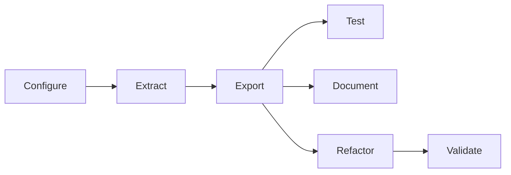

# Extraction Pipeline Template

Cookie-cutter template for turning an Excel financial model into a semantic, distributable Python library using [excel-grapher](https://github.com/Teal-Insights/excel-grapher). The pipeline combines target-driven graph extraction, explicit dynamic-reference constraints, series bindings, LLM-assisted naming and documentation, and Excel-backed parity tests.

See [technical-standard.md](technical-standard.md) for the acceptance bar and [lessons-learned.md](lessons-learned.md) for design rationale.

## What you provide

Before running the pipeline, populate this repository with workbook-specific inputs:

| Input | Location | Purpose |
|---|---|---|
| Workbook | `data/workbook.xlsx` | Source Excel model |
| Human guide | `data/guide.md` | Domain usage, public I/O catalog, scenario narrative |
| Targets | `workbook_config.py` → `TARGETS` | Named ranges or addresses driving graph extraction |
| Constraints | `workbook_config.py` → `CONSTRAINTS` | Dynamic-ref resolution and leaf input/constant classification |
| Series bindings | `bindings/inputs.bindings.yaml`, `bindings/outputs.bindings.yaml` | Records-shaped public API surface |
| Package metadata | `workbook_config.py` → `DIST_METADATA` | Generated `dist/` project name, docs URLs, README |
| Parity evidence | `data/differential/exported_library/` | Reference reports after a passing Excel sweep (optional until export) |

Use [templates/binding-authoring-prompt.txt](templates/binding-authoring-prompt.txt) with a coding agent to draft bindings from the guide, workbook, and extracted graph.

## Pipeline stages

The end-to-end workflow follows the stage gates in `good-extraction-standard.md`:



### 1. Configure

1. Edit [workbook_config.py](workbook_config.py): paths, `TARGETS`, `CONSTRAINTS`, and `DIST_METADATA`.
2. Author `bindings/*.bindings.yaml` (schema version `1.2.0`, one logical series per public API function).
3. Constrain cells that control `OFFSET` / `INDEX` / `MATCH` / `CHOOSE` so dynamic refs resolve completely.
4. Classify every leaf as `input` or `constant`; every mutable input leaf must appear in `inputs.bindings.yaml`.

Validation checks:

- `validate_series_bindings(...)` reports `ok`
- `derive_input_series` / `derive_output_series` resolve every binding
- No unbound mutable input leaves

### 2. Extract

Build the dependency graph with provenance enabled:

```python
from excel_grapher.grapher import DynamicRefConfig, create_dependency_graph

graph = create_dependency_graph(
    workbook_path,
    targets,
    load_values=True,
    dynamic_refs=DynamicRefConfig.from_constraints(constraints, {}),
    capture_dependency_provenance=True,
)
```

Review graph completeness manually: expected sheets, no spurious nodes, shock/engine paths present. Optionally run semantic labeling and write an interactive graph site (see [Graph exploration](#graph-exploration)).

### 3. Export

The pipeline applies `OptimalCompression` over the canonical graph, generates a records-shaped API (`make_context`, `set_*`, `compute_*`), writes `dist/<package>/`, and copies the validation bundle into `dist/tests/`.

### 4. Test

Run a representative scenario through the semantic API, then Excel parity:

```bash
uv run python tests/differential/differential_test_exported_library.py
```

On Windows with Excel installed, re-run from the exported project:

```pwsh
uv run --project dist --group validation python tests/differential_test_exported_library.py --layout exported
```

### 5. Document

Great Docs generates the distributable website from the exported package. LLM rewrites guide sections into Python-first user-guide pages when cache misses require an API key.

### 6. Refactor

Cluster parallel formula families, collapse internals with LLM-authored semantic helpers behind a parity gate, and prune thin wrappers. Each refactor pass re-runs differential tests.

## Run the pipeline

```bash
uv sync
uv run python -m src.extraction_pipeline
```

### Prerequisites

LLM steps (semantic labeling, docstrings, internals refactor, guide rewrites) cache results under `.cache/`. A clean run reproduces committed output without an API key unless inputs change. For uncached steps, set provider API keys and per-stage model names in a `.env` file at the repository root:

```bash
# .env — provider API keys (set the key for whichever model family you use)
OPENAI_API_KEY=sk-...
ZAI_API_KEY=...
DEEPSEEK_API_KEY=...

# Per-stage model selection (name prefix selects the provider: gpt-*, glm-*, deepseek-*)
SEMANTIC_LABEL_MODEL=gpt-5.5
DOCSTRING_MODEL=gpt-5.5
REFACTOR_MODEL=gpt-5.5
SECTION_REWRITE_MODEL=gpt-5.5
```

If an uncached LLM step is reached without the required API key, the pipeline fails fast with an `*_API_KEY is required ...` error.

DeepSeek runs with thinking mode disabled by default. To enable it (and pass reasoning effort through, which DeepSeek only honors in thinking mode), set `DEEPSEEK_THINKING` to a truthy value (`1`, `true`, `yes`, or `on`):

```bash
DEEPSEEK_THINKING=1
```

## Graph exploration

After extraction, write an interactive Cytoscape site from the dependency graph:

```python
from pathlib import Path
from src.dependency_graph_viz import (
    constant_keys_from_leaf_classification,
    semantic_node_labels,
    series_cell_keys,
    write_dependency_graph_site,
)

output_dir = Path("docs/dependency-graph")
write_dependency_graph_site(
    graph,
    output_dir,
    node_labels=semantic_node_labels(graph),
    input_keys=series_cell_keys(input_series),
    output_keys=series_cell_keys(output_series),
    constant_keys=constant_keys_from_leaf_classification(leaf_classification),
)
```

Serve locally (do not commit generated JSON/HTML):

```bash
uv run python -m http.server 8000 --directory docs/dependency-graph
```

Open `http://localhost:8000/`.

## Checklist for a new workbook

- [ ] Outputs declared as extraction targets in `workbook_config.py`
- [ ] `bindings/inputs.bindings.yaml` + `outputs.bindings.yaml` validated
- [ ] Dynamic-ref constraint candidates constrained
- [ ] All leaves classified; mutable leaves bound
- [ ] Graph extracts with provenance; manual completeness review done
- [ ] `dist/` package builds; semantic API scenario runs
- [ ] Validation bundle exported
- [ ] Public API uses domain language; docstrings present
- [ ] Internals refactored; differential parity passes

## Development

```bash
uv sync
uv run pre-commit install
uv run pytest
uv run ruff check
uv run ruff format
uv run ty check
```

Opt-in LLM graph spot-check tests: `uv run pytest --run-skipped` (requires `OPENAI_API_KEY`).

## Repository layout

| Path | Role |
|---|---|
| `workbook_config.py` | Workbook-specific configuration boundary |
| `src/` | Reusable pipeline implementation |
| `bindings/` | Series binding sidecars (user-authored) |
| `data/` | Workbook, guide, differential reports |
| `dist/` | Generated distributable package (gitignored) |
| `templates/` | Binding prompt and canonical API usage reference |
| `artifacts/` | Extraction standard and lessons learned |
| `archive/` | Archived source notes (not maintained workflow docs) |
